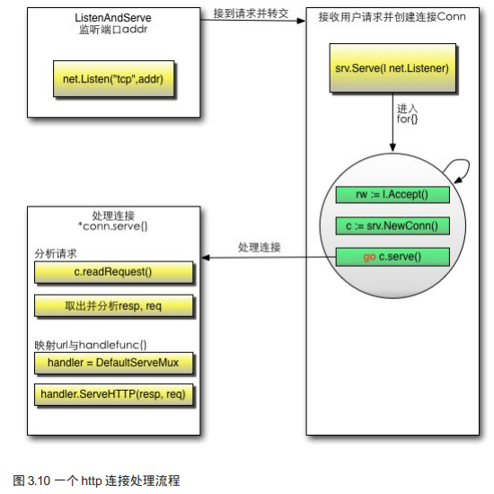

# http.ListenAndServe 机制 源码分析

<!-- vscode-markdown-toc -->
* 1. [说明](#)
* 2. [分析概要](#-1)
	* 2.1. [ 名词解释](#-1)
	* 2.2. [http包执行流程](#http)
* 3. [源码分析](#-1)

<!-- vscode-markdown-toc-config
	numbering=true
	autoSave=true
	/vscode-markdown-toc-config -->
<!-- /vscode-markdown-toc -->

##  1. 说明

[分析示例:coding/c0001](../coding/c0001)

[源码位置:/src/net/http/server.go](../go/src/net/http/server.go)

##  2. 分析概要

###  2.1.  名词解释

Request：用户请求的信息，用来解析用户的请求信息，包括method，Cookie，url等信息。

Response:服务器需要反馈给客户端的信息。

Conn：用户的每次请求链接。

Handle:处理请求和生成返回信息的处理逻辑。

###  2.2. http包执行流程

*golang 实现web服务的流程*

创建Listen Socket，监听指定的端口，等待客户端请求到来。
Listen Socket接受客户端的请求，得到Client Socket，接下来通过Client Socket与客户端通信。
处理客户端请求，首先从Client Socket读取HTTP请求的协议头，如果是POST方法，还可能要读取客户端提交的数据，然后交给相应的handler处理请求，handler处理完，将数据通过Client Socket返回给客户端。

### http执行流程小结

<strong>1、启动监听服务</strong>
实例化Server。
调用Server的ListenAndServe()。
调用net.Listen("tcp",addr)监听端口。
启动一个for循环，在循环体中Accept请求。

<strong>2、注册路由处理器</strong>
a. 首先调用Http.HandleFunc，按如下顺序执行：
- 调用了DefaultServerMux的HandleFunc。
- 调用了DefaultServerMux的Handle。
- 往DefaultServerMux的map[string] muxEntry中增加对应的handler和路由规则。

b. 调用http.ListenAndServe(":9090",nil)，按如下顺序执行：

<strong>3、响应请求并处理逻辑</strong>
a.对每个请求实例化一个Conn，并且开启一个goroutine为这个请求进行服务go c.serve()。
b.读取每个请求的内容w,err:=c.readRequest()。
c.判断handler是否为空，如果没有设置handler，handler默认设置为DefaultServeMux。
d.调用handler的ServeHttp。
e.根据request选择handler，并且进入到这个handler的ServeHTTP, mux.handler(r).ServeHTTP(w,r)
f.选择handler
- 判断是否有路由能满足这个request（循环遍历ServeMux的muxEntry）。
- 如果有路由满足，调用这个路由handler的ServeHttp。
- 如果没有路由满足，调用NotFoundHandler的ServeHttp。

##  3. 源码分析