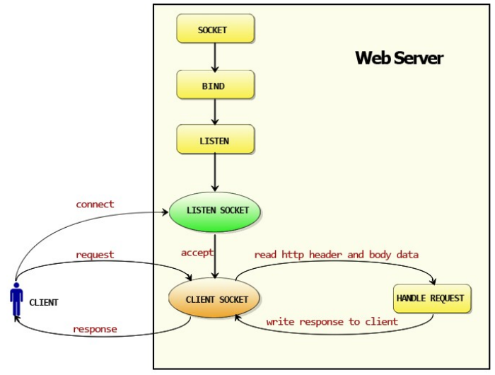

# http.ListenAndServe 机制 源码分析

<!-- vscode-markdown-toc -->
* 1. [说明](#)
* 2. [分析概要](#-1)
	* 2.1. [ 名词解释](#-1)
	* 2.2. [http包执行流程](#http)
* 3. [源码分析](#-1)

<!-- vscode-markdown-toc-config
	numbering=true
	autoSave=true
	/vscode-markdown-toc-config -->
<!-- /vscode-markdown-toc -->

##  1. 说明

[分析示例:coding/c0001](../coding/c0001)
[源码位置:/src/net/http/server.go](../go/src/net/http/server.go)

##  2. 分析概要

###  2.1.  名词解释

Request：用户请求的信息，用来解析用户的请求信息，包括post，get，Cookie，url等信息。
Response:服务器需要反馈给客户端的信息。
Conn：用户的每次请求链接。
Handle:处理请求和生成返回信息的处理逻辑。

###  2.2. http包执行流程

*golang 实现web服务的流程*

创建Listen Socket，监听指定的端口，等待客户端请求到来。
Listen Socket接受客户端的请求，得到Client Socket，接下来通过Client Socket与客户端通信。
处理客户端请求，首先从Client Socket读取HTTP请求的协议头，如果是POST方法，还可能要读取客户端提交的数据，然后交给相应的handler处理请求，handler处理完，将数据通过Client Socket返回给客户端。

##  3. 源码分析