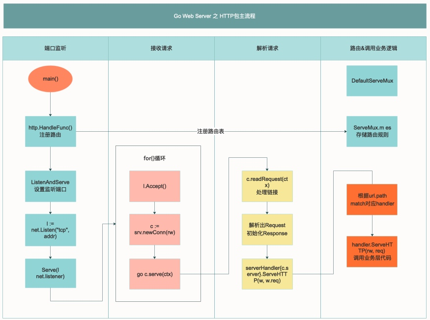

# http.ListenAndServe 机制 源码分析

<!-- vscode-markdown-toc -->
* 1. [说明](#)
* 2. [分析概要](#-1)
	* 2.1. [ 名词解释](#-1)
	* 2.2. [http包执行流程](#http)
* 3. [源码分析](#-1)

<!-- vscode-markdown-toc-config
	numbering=true
	autoSave=true
	/vscode-markdown-toc-config -->
<!-- /vscode-markdown-toc -->

##  1. <a name=''></a>说明

[分析示例:coding/c0001](../coding/c0001)

[源码位置:/src/net/http/server.go](../go/src/net/http/server.go)

##  2. <a name='-1'></a>分析概要

###  2.1. <a name='-1'></a> 名词解释

Request：用户请求的信息，用来解析用户的请求信息，包括method，Cookie，url等信息。

Response:服务器需要反馈给客户端的信息。

Conn：用户的每次请求链接。

Handle:处理请求和生成返回信息的处理逻辑。

###  2.2. <a name='http'></a>http包执行流程


*golang 实现web服务的流程*

创建Listen Socket，监听指定的端口，等待客户端请求到来。
Listen Socket接受客户端的请求，得到Client Socket，接下来通过Client Socket与客户端通信。
处理客户端请求，首先从Client Socket读取HTTP请求的协议头，如果是POST方法，还可能要读取客户端提交的数据，然后交给相应的handler处理请求，handler处理完，将数据通过Client Socket返回给客户端。


### http执行流程小结

<strong>1、启动监听服务</strong>
实例化Server。
调用Server的ListenAndServe()。
调用net.Listen("tcp",addr)监听端口。
启动一个for循环，在循环体中Accept请求。

<strong>2、注册路由处理器</strong>
a. 首先调用Http.HandleFunc，按如下顺序执行：
- 调用了DefaultServerMux的HandleFunc。
- 调用了DefaultServerMux的Handle。
- 往DefaultServerMux的map[string] muxEntry中增加对应的handler和路由规则。

b. 调用http.ListenAndServe(":9090",nil)，按如下顺序执行：

<strong>3、响应请求并处理逻辑</strong>
a.对每个请求实例化一个Conn，并且开启一个goroutine为这个请求进行服务go c.serve()。
b.读取每个请求的内容w,err:=c.readRequest()。
c.判断handler是否为空，如果没有设置handler，handler默认设置为DefaultServeMux。
d.调用handler的ServeHttp。
e.根据request选择handler，并且进入到这个handler的ServeHTTP, mux.handler(r).ServeHTTP(w,r)
f.选择handler
- 判断是否有路由能满足这个request（循环遍历ServeMux的muxEntry）。
- 如果有路由满足，调用这个路由handler的ServeHttp。
- 如果没有路由满足，调用NotFoundHandler的ServeHttp。



##  3. <a name='-1'></a>源码分析

### 端口监听
搭建 web 服务器的时候有行代码：http.ListenAndServe(":9999", nil)

http.ListenAndServe 实际上，初始化一个server对象，调用了 server 的 ListenAndServe 方法

```go
func ListenAndServe(addr string, handler Handler) error {
    server := &Server{Addr: addr, Handler: handler}
    return server.ListenAndServe()
}
```
然后是 ln, err := net.Listen("tcp", addr) ，用TCP协议搭建了一个服务，监听着设置的端口

```go
func (srv *Server) ListenAndServe() error {
    if srv.shuttingDown() {
        return ErrServerClosed
    }
    addr := srv.Addr
    if addr == "" {
        addr = ":http"
    }
    ln, err := net.Listen("tcp", addr)
    if err != nil {
        return err
    }
    return srv.Serve(ln)
}
```

### 接收请求

```go
for {
        // 接受监听器listener的请求
        rw, e := l.Accept()
        if e != nil {
            // 监听是否关闭信号
            select {
            case <-srv.getDoneChan():
                return ErrServerClosed
            default:
            }
        }
            ……
        // 创建新连接
        c := srv.newConn(rw)
        // 再返回之前，设置连接状态
        c.setState(c.rwc, StateNew) // before Serve can return
        // 创建goroutine，真正处理连接
        go c.serve(ctx)
    }
```

如上， srv.Serve(ln) 中 使用一个for{} 循环接收请求，
> 1.首先通过 listener.Accept 接受请求，是不是跟上面提到的socket的运行机制很像了。
> 2.接着用接受到的请求创建一个新的 Conn，并设置为New状态。
> 3.最后创建 goroutine，真正的处理连接。

<strong>补充</strong>：每个请求都会创建一个对应的goroutine去处理，所以各个请求之间是相互不影响的，同时提高并发性能。

### 读取请求并解析

```go
for {
        ……
    
        // 读request请求
        w, err := c.readRequest(ctx)
        
        ……
        // 调用业务层定义的路由
        serverHandler{c.server}.ServeHTTP(w, w.req)
        
        ……
        // flush刷io buffer的数据
        w.finishRequest()
```

go c.serve(ctx) 响应并处理请求, 
readRequest 便是读取数据，解析请求的地方，包括解析请求的header、body，和一些基本的校验，比如header头信息，请求method等。

最后将请求的数据赋值到Request，并初始化Response对象，供业务层调用。

### 路由分配handler
上面关键流程已经看到了serverHandler{c.server}.ServeHTTP(w, w.req)，这个实际上就是调用最开始在main函数定义的handler，并将处理好的Request、Response对象作为参数传入。

```go
type serverHandler struct {
    srv *Server
}

func (sh serverHandler) ServeHTTP(rw ResponseWriter, req *Request) {
    handler := sh.srv.Handler
    if handler == nil {
        handler = DefaultServeMux
    }
    if req.RequestURI == "*" && req.Method == "OPTIONS" {
        handler = globalOptionsHandler{}
    }
    handler.ServeHTTP(rw, req)
}
```

还记得吗，我们最上面是这样调用的 http.ListenAndServe(":9999", nil)，第二个参数是nil。

所以，你看在ServeHTTP中，handler = DefaultServeMux，我们使用了默认的路由器，如果 ListenAndServe 不是传nil的话，那就会使用你自己定义的路由器。

### 路由分配handler
好了，我们知道了使用默认的路由器（DefaultServeMux），再看看它是怎么根据路径找对应handler的吧

路由的过程里面只要弄懂下面的三个问题，就知道 Go 自带的路由是怎么运行的了：

1.什么时候注册的路由？
2.如何根据注册的路由找对应的handler？
3.如果没注册路由访问会返回什么？

先来看看默认路由器（DefaultServeMux）的结构定义：

```go
type ServeMux struct {
    mu    sync.RWMutex
    m     map[string]muxEntry
    es    []muxEntry 
    hosts bool
}
```
其中 m 是一个map，用来存储路由pattern与handler的关系；es 是一个slice，将路由按长度从大到小排序存储起来。

匹配规则：首先精确匹配 m 中的pattern；如果在 m 不能精确匹配路径时，会在 es 中找到最接近的路由规则：比如注册了两个路径 /a/b/ /a/ ，当请求URL是 /a/b/c时，会匹配到 /a/b/ 而不是 /a/。

<strong>1. 什么时候注册的路由？</strong>

还记得吧，在 ListenAndServe 之前，有这么一行代码，http.HandleFunc("/", indexHandler)，这个便是在注册路由。来我们把一些检查代码去掉，看看关键代码：

```go
func HandleFunc(pattern string, handler func(ResponseWriter, *Request)) {
    DefaultServeMux.HandleFunc(pattern, handler)
}

func (mux *ServeMux) HandleFunc(pattern string, handler func(ResponseWriter, *Request)) {
    ……
    mux.Handle(pattern, HandlerFunc(handler))
}

func (mux *ServeMux) Handle(pattern string, handler Handler) {
    ……
    e := muxEntry{h: handler, pattern: pattern}
    mux.m[pattern] = e
    if pattern[len(pattern)-1] == '/' {
        mux.es = appendSorted(mux.es, e)
    }

    if pattern[0] != '/' {
        mux.hosts = true
    }
}
```
这就是把路由表往 ServeMux.m 和 ServeMux.es 写的全过程

<strong>2. 如何根据注册的路由找对应的handler？</strong>

其实知道怎么写路由表，大概也能猜到是怎么进行找了，无非就是从上面的 m，es 进行匹配。

我们上面从端口监听，接受请求，读取请求并解析，再到路由分配handler，一路追到 handler.ServeHTTP(rw, req)，现在再看看这段代码的实现

```go
// 根据预设的pattern，将request分配最匹配的handler处理
func (mux *ServeMux) ServeHTTP(w ResponseWriter, r *Request) {
    ……
    h, _ := mux.Handler(r)
    h.ServeHTTP(w, r)
}

……

func (mux *ServeMux) handler(host, path string) (h Handler, pattern string) {
    if mux.hosts {
        h, pattern = mux.match(host + path)
    }
    if h == nil {
        h, pattern = mux.match(path)
    }
    if h == nil {
        h, pattern = NotFoundHandler(), ""
    }
    return
}

func (mux *ServeMux) match(path string) (h Handler, pattern string) {
    // 优先查找m表
    v, ok := mux.m[path]
    if ok {
        return v.h, v.pattern
    }

    // 未精确匹配成功，查询es（已排序），路径长的优先匹配
    for _, e := range mux.es {
        if strings.HasPrefix(path, e.pattern) {
            return e.h, e.pattern
        }
    }
    return nil, ""
}
```

<strong>3. 如果没注册路由访问会返回什么？</strong>

这个问题其实上面代码已经看到了，Go 内置了一个 NotFoundHandler()，返回 "404 page not found"