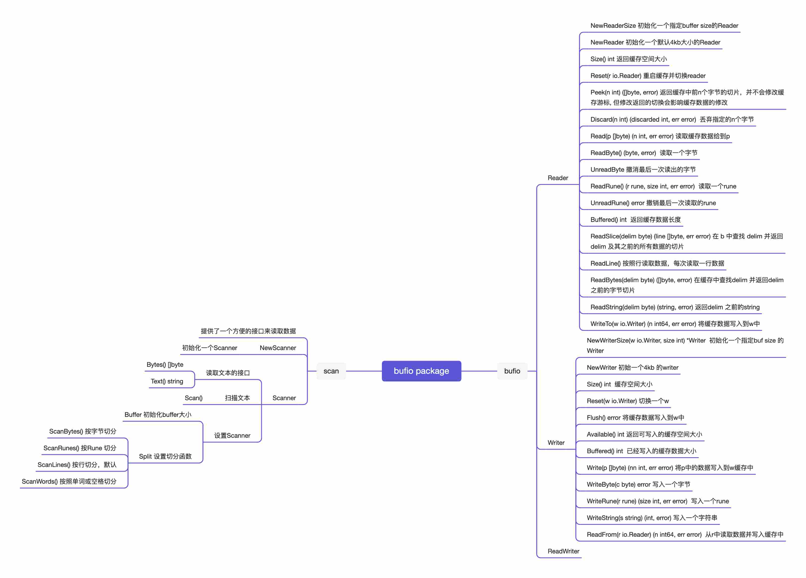

## 注意事项

默认扫描方式按行扫描 ScanLines.

单次扫描文本最大值是64k MaxScanTokenSize = 64 * 1024

除非能确定行长度不超过65536，否则不要使用bufio.Scanner！如果建议使用ReadBytes或ReadString

当然也可以在调用Scan()之前设置buffer和MaxScanTokenSize的大小 比如: scanner.Buffer([]byte{}, bufio.MaxScanTokenSize*10)

按行去读取数据在 bufio.Reader 中也提供了 ReadLine() 或 ReadString('\n') 或 ReadBytes('\n') 可供选择

## 陷阱分析

> 特殊情况需要注意的就是: 当数据末尾没有\n的时候，直到EOF还没有分隔符\n，这时候返回EOF错误，但是line里面还是有数据的，如果不处理的话就会漏掉最后一行.

```go
s := "a\nb\nc"
reader := bufio.NewReader(strings.NewReader(s))
for {
    line, err := reader.ReadString('\n')
    if err != nil {
        if err == io.EOF {
            // **处理当数据末尾没有\n的情况**
            fmt.Printf("%#v\n", line)
            break
        }
        panic(err)
    }
    fmt.Printf("%#v\n", line)
}
// 关键点：最后一次返回的错误是 io.EOF，line 里面是可能有数据的。这样不会遗漏最后一行，
buf := bufio.NewReader(bytes.NewReader(r))
for {
	line, err := buf.ReadString('\n')
	if err == nil || err == io.EOF {
		line = strings.TrimSpace(line)
		if line != "" {
			fmt.Println(line)
		}
	}
	if err != nil {
		break
	}
}
```

通常情况下建议使用Scanner, 如果能预估buffer大小，最后设置合适的buffer 

```go
// Split functions defaults to ScanLines

// ScanBytes is a split function for a Scanner that returns each byte as a token.
// data []byte 待处理扫描的数据
// atEOF bool  判断数据是否处理完成

// advance int  返回要处理的字节数
// token []byte 保存要处理的内容
// 
func ScanBytes(data []byte, atEOF bool) (advance int, token []byte, err error) {
	if atEOF && len(data) == 0 {
		return 0, nil, nil
	}
	return 1, data[0:1], nil
}

func main(){
    scanner:=bufio.NewScanner(strings.NewReader("ABCDEFG\nHIJKELM"),)
    // 可以在调用Scan之前设置buffer和MaxScanTokenSize的大小
    scanner.Buffer([]byte{}, bufio.MaxScanTokenSize*10)
    for scanner.Scan(){
        fmt.Println(scanner.Text()) // scanner.Bytes()
    }
//  通过 scanner.Err(); 我们可以捕捉到 扫描中的错误信息,这对单行文件超过 MaxScanTokenSize 时特别有用
    if err := scanner.Err(); err != nil {
        fmt.Fprintln(os.Stderr, "reading standard input:", err)
    }
}
```