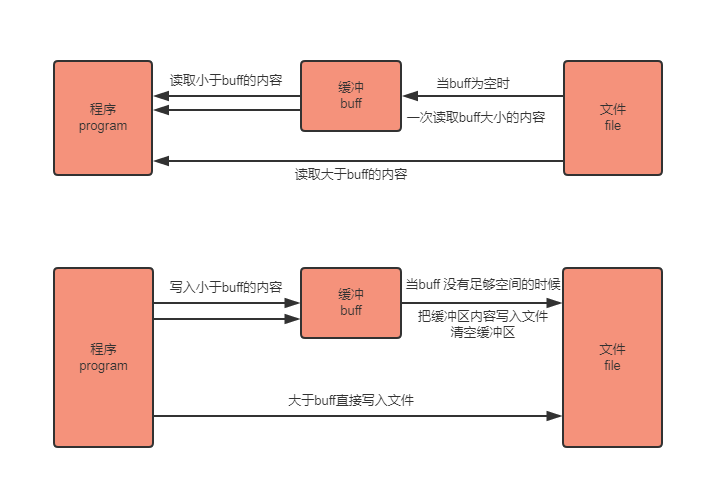

[分析示例:coding/bufio](../coding/bufio)

[源码位置:/src/bufio](../go/src/bufio)

## bufio包介绍
bufio包实现了有缓冲的I/O。它包装一个io.Reader或io.Writer接口对象，创建另一个也实现了该接口，且同时还提供了缓冲和一些文本I/O的帮助函数的对象。

## bufio 是通过缓冲来提高效率

os包提供的Write方法是没有缓存功能的， 它会直接写到磁盘上， 相比bufio 先缓存一定的数据在统一写入到磁盘中， 不带缓冲功能的Write方法会带来额外的IO开销;

简单的说就是，把文件读取进缓冲（内存）之后再读取的时候就可以避免文件系统的io 从而提高速度。同理，在进行写操作时，先把文件写入缓冲（内存），然后由缓冲写入文件系统。看完以上解释有人可能会表示困惑了，直接把 内容->文件 和 内容->缓冲->文件相比， 缓冲区好像没有起到作用嘛。其实缓冲区的设计是为了存储多次的写入，最后一口气把缓冲区内容写入文件。

bufio 封装了io.Reader或io.Writer接口对象，并创建另一个也实现了该接口的对象

io.Reader或io.Writer 接口实现read() 和 write() 方法，对于实现这个接口的对象都是可以使用这两个方法的



## bufio 源码分析

### bufio.Read 

bufio.Read(p []byte) 相当于读取大小len(p)的内容，思路如下：

- 当缓存区有内容的时，将缓存区内容全部填入p并清空缓存区
- 当缓存区没有内容的时候且len(p)>len(buf),即要读取的内容比缓存区还要大，直接去文件读取即可
- 当缓存区没有内容的时候且len(p)<len(buf),即要读取的内容比缓存区小，缓存区从文件读取内容充满缓存区，并将p填满（此时缓存区有剩余内容）
- 以后再次读取时缓存区有内容，将缓存区内容全部填入p并清空缓存区（此时和情况1一样）

> reader内部通过维护一个r, w 即读入和写入的位置索引来判断是否缓存区内容被全部读出

### bufio.Write 

bufio.Write(p []byte) 的思路如下

- 判断buf中可用容量是否可以放下 p
- 如果能放下，直接把p拼接到buf后面，即把内容放到缓冲区
- 如果缓冲区的可用容量不足以放下，且此时缓冲区是空的，直接把p写入文件即可
- 如果缓冲区的可用容量不足以放下，且此时缓冲区有内容，则用p把缓冲区填满，把缓冲区所有内容写入文件，并清空缓冲区
- 判断p的剩余内容大小能否放到缓冲区，如果能放下（此时和步骤1情况一样）则把内容放到缓冲区
- 如果p的剩余内容依旧大于缓冲区，（注意此时缓冲区是空的，情况和步骤2一样）则把p的剩余内容直接写入文件

### 深入理解 bufio.SplitFunc 

```go
type SplitFunc func(data []byte, atEOF bool) (advance int, token []byte, err error)
```

Scanner是有缓存的，意思是Scanner底层维护了一个Slice用来保存已经从Reader中读取的数据，Scanner会调用我们设置SplitFunc，将缓冲区内容(data)和是否已经输入完了(atEOF)以参数的形式传递给SplitFunc，而SplitFunc的职责就是根据上述的两个参数返回下一次Scan需要前进几个字节(advance)，分割出来的数据(token)，以及错误(err)。

这是一个通信双向的过程，Scanner告诉我们的SplitFunc已经扫描到的数据和是否到结尾了，我们的SplitFunc则根据这些信息将分割的结果返回和下次扫描需要前进的位置返回给Scanner。用一个例子来说明：

```go
package main
import (
 "bufio"
 "fmt"
 "strings"
)
func main() {
 input := "abcdefghijkl"
 scanner := bufio.NewScanner(strings.NewReader(input))
 split := func(data []byte, atEOF bool) (advance int, token []byte, err error) {
  fmt.Printf("%t\t%d\t%s\n", atEOF, len(data), data)
  return 0, nil, nil
 }
 scanner.Split(split)
 buf := make([]byte, 2)
 scanner.Buffer(buf, bufio.MaxScanTokenSize)
 for scanner.Scan() {
  fmt.Printf("%s\n", scanner.Text())
 }
}
```

output 

```
false 2 ab
false 4 abcd
false 8 abcdefgh
false 12 abcdefghijkl
true 12 abcdefghijkl
```

这里我们把缓冲区的初始大小设置为了2，不够的时候会扩展为原来的2倍，最大为bufio.MaxScanTokenSize,这样一开始扫描2个字节，我们的缓冲区就满了，reader的内容还没有读取到EOF，然后split函数执行，输出:

```
false 2 ab
```
紧接着函数返回 0, nil, nil这个返回值告诉Scanner数据不够，下次读取的位置前进0位，需要继续从reader里面读取,此时因为缓冲区满了，所以容量扩展为2 * 2 = 4，reader的内容还没有读取到EOF，输出

```
false 4 abcd
```

重复上述步骤，一直到最后全部内容读取完了，EOF此时变成了true

```
true 12 abcdefghijkl
```

### 深入理解bufio.Write方法
bufio包实现了带缓冲的I/O，它封装了io.Reader和io.Writer对象，然后创建了另外一种对象（Reader或Writer）实现了相同的接口，但是增加了缓冲功能。

首先来看没有缓冲功能的Write(os包中)方法，它会将数据直接写到文件中。

```go
package main
 
import (
 "os"
 "fmt"
)
 
func main() {
 file, err := os.OpenFile("a.txt", os.O_CREATE|os.O_RDWR, 0666)
 if err != nil {
  fmt.Println(err)
 }
 defer file.Close()
 
 content := []byte("hello world!")
 if _, err = file.Write(content); err != nil {
  fmt.Println(err)
 }
 fmt.Println("write file successful")
}
```

接着看一个错误的使用带缓冲的Write方法例子，当下面的程序执行后是看不到写入的数据的。

```go
package main
 
import (
  "os"
  "fmt"
  "bufio"
)
 
func main() {
  file, err := os.OpenFile("a.txt", os.O_CREATE|os.O_RDWR, 0666)
  if err != nil {
    fmt.Println(err)
  }
  defer file.Close()
 
  content := []byte("hello world!")
  newWriter := bufio.NewWriter(file)
  if _, err = newWriter.Write(content); err != nil {
    fmt.Println(err)
  }
  fmt.Println("write file successful")
}
```
为什么会在文件中看不到写入的数据呢, Write方法首先会判断写入的数据长度是否大于设置的缓冲长度，如果小于，则会将数据copy到缓冲中；当数据长度大于缓冲长度时，如果数据特别大，则会跳过copy环节，直接写入文件。其他情况依然先会将数据拷贝到缓冲队列中，然后再将缓冲中的数据写入到文件中。

所以上面的错误示例，只要给其添加Flush()方法，将缓存的数据写入到文件中。

```go
package main
 
import (
  "os"
  "fmt"
  "bufio"
)
 
func main() {
  file, err := os.OpenFile("./a.txt", os.O_CREATE|os.O_RDWR, 0666)
  if err != nil {
    fmt.Println(err)
  }
  defer file.Close()
 
  content := []byte("hello world!")
  newWriter := bufio.NewWriterSize(file, 1024)
  if _, err = newWriter.Write(content); err != nil {
    fmt.Println(err)
  }
  if err = newWriter.Flush(); err != nil {
    fmt.Println(err)
  }
  fmt.Println("write file successful")
}
```

## 注意事项

默认扫描方式按行扫描 ScanLines.

单次扫描文本最大值是64k MaxScanTokenSize = 64 * 1024

除非能确定行长度不超过65536，否则不要使用bufio.Scanner！如果建议使用ReadBytes或ReadString

当然也可以在调用Scan()之前设置buffer和MaxScanTokenSize的大小 比如: scanner.Buffer([]byte{}, bufio.MaxScanTokenSize*10)

按行去读取数据在 bufio.Reader 中也提供了 ReadLine() 或 ReadString('\n') 或 ReadBytes('\n') 可供选择

## 陷阱分析

### 丢数据 

> 特殊情况需要注意的就是: 当数据末尾没有\n的时候，直到EOF还没有分隔符\n，这时候返回EOF错误，但是line里面还是有数据的，如果不处理的话就会漏掉最后一行.

```go
s := "a\nb\nc"
reader := bufio.NewReader(strings.NewReader(s))
for {
    line, err := reader.ReadString('\n')
    if err != nil {
        if err == io.EOF {
            // **处理当数据末尾没有\n的情况**
            fmt.Printf("%#v\n", line)
            break
        }
        panic(err)
    }
    fmt.Printf("%#v\n", line)
}
// 关键点：最后一次返回的错误是 io.EOF，line 里面是可能有数据的。这样不会遗漏最后一行，
buf := bufio.NewReader(bytes.NewReader(r))
for {
	line, err := buf.ReadString('\n')
	if err == nil || err == io.EOF {
		line = strings.TrimSpace(line)
		if line != "" {
			fmt.Println(line)
		}
	}
	if err != nil {
		break
	}
}
```

### Scanner 初始化buffer size

> 通常情况下建议使用Scanner, 如果能预估buffer大小，最后设置合适的buffer 

```go
// Split functions defaults to ScanLines

// ScanBytes is a split function for a Scanner that returns each byte as a token.
// data []byte 待处理扫描的数据
// atEOF bool  判断数据是否处理完成

// advance int  返回要处理的字节数
// token []byte 保存要处理的内容
// 
func ScanBytes(data []byte, atEOF bool) (advance int, token []byte, err error) {
	if atEOF && len(data) == 0 {
		return 0, nil, nil
	}
	return 1, data[0:1], nil
}

func main(){
    scanner:=bufio.NewScanner(strings.NewReader("ABCDEFG\nHIJKELM"),)
    // 可以在调用Scan之前设置buffer和MaxScanTokenSize的大小
    scanner.Buffer([]byte{}, bufio.MaxScanTokenSize*10)
    for scanner.Scan(){
        fmt.Println(scanner.Text()) // scanner.Bytes()
    }
//  通过 scanner.Err(); 我们可以捕捉到 扫描中的错误信息,这对单行文件超过 MaxScanTokenSize 时特别有用
    if err := scanner.Err(); err != nil {
        fmt.Fprintln(os.Stderr, "reading standard input:", err)
    }
}
```

bufio的Reader和Writer操作一般适用于磁盘IO的读写场景。通过bufio标准库，实现对输入数据的读取、处理和输出操作。

### Reader buffersize 初始化

```go
reader:=bufio.NewReader(oldReader) // 默认size为4096
reader:=bufio.NewReaderSize(oldReader, size)

bytes, error = reader.ReadSlice(delim) /*结束符*/
bytes, error = reader.ReadString(delim)
bytes, error = reader.ReadLine()        // 默认换行符\n
bytes, error = reader.ReadBytes(delim)
n, error = reader.Reader([]byte)

var bts = make([]byte, 100) // 初始化,保证有足够写入空间
reader:=bufio.NewReader(strings.NewReader("ABCDEFG\nHIJKLMN\n")
_, err = reader.Read(bts) //传递写入副本
```
这里要平时注意的一点：var bts = make([]byte, 100), 需要初始化。
slice类型变量首先要初始化， 如果不初始化，则如果在调用的方法体内初始化，则返回时，slice类型变量还是旧值。

> slice底层实际上是struct结构体类型，有len，cap和指针数组组成。所以函数体内初始化则内存地址和传入的内存地址不是一致的，读到的数据是旧的
> 如果传入参数是初始化的，则相当于func(temp=Struct{}/传入参数param/)， 虽然地址不一样，但是重新赋值了，且len、cap值相同，底层的指针数组还是指向一样的内存地址，如果底层数组的内存地址存放的数据发生变化，由于指向数组的指针没有变化，则传入参数可是指向了底层数组新的数据。


### func (b *Writer) Write(p []byte) (int, error)方法的正确理解

```
如果内存缓冲区剩余空间小于len(p)，分两种情况讨论：
    如果当前内存缓冲区为空，则直接把p数据写入到磁盘IO，b.wr.Write(p);
    如果当前内存缓冲区不空，则首先把缓冲区填满，然后先把内存缓冲区的数据进行一次磁盘IO回写操作，之后内存缓冲区可用大小有是len(Writer.buf)长度了，这时又分两种情况讨论：第一种：如果剩余要处理的p数据小于内存缓冲区的大小, 则把剩余数据p写入到内存缓冲区；第二种：如果剩余要处理的p数据大于等于内存缓冲区，则没必要缓冲了，直接整体一次回写到磁盘。
如果内存缓冲区剩余空间大于等于len(p), 则先把数据暂存到缓冲区，减少磁盘IO。
```

