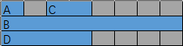
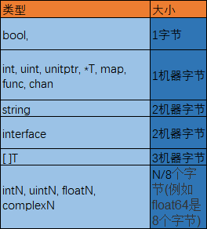
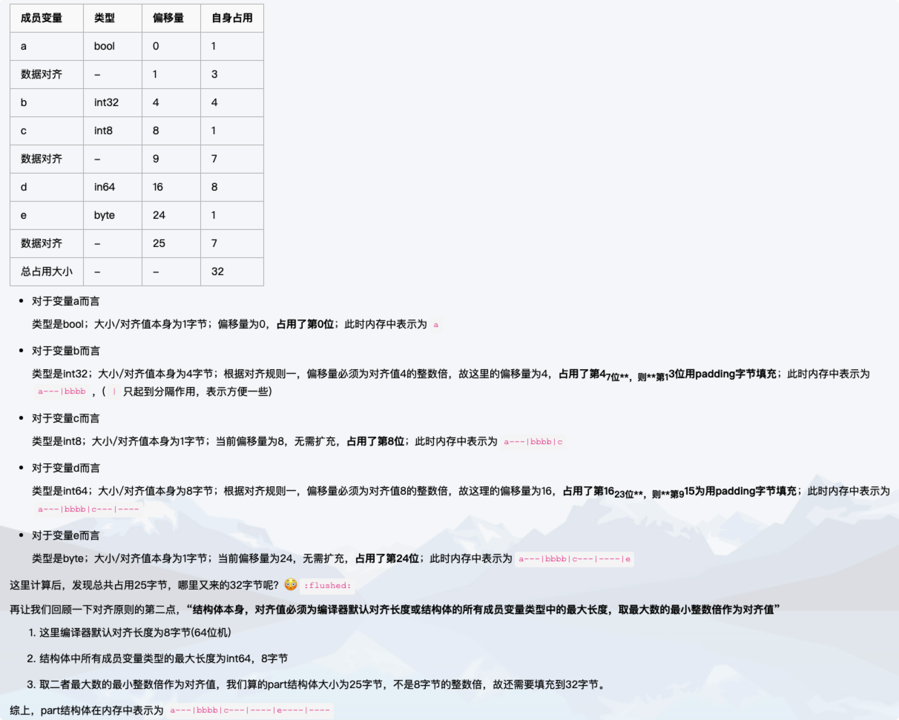

unsafe 包绕过了 Go 的类型系统，达到直接操作内存的目的，使用它有一定的风险性。但是在某些场景下，使用 unsafe 包提供的函数会提升代码的效率，Go 源码中也是大量使用 unsafe 包。

通过 unsafe 相关函数，可以获取结构体私有成员的地址，进而对其做进一步的读写操作，突破 Go 的类型安全限制。

unsafe 包定义了 Pointer 和三个函数：

```go
type ArbitraryType int	
type Pointer *ArbitraryType	
func Sizeof(x ArbitraryType) uintptr	
func Offsetof(x ArbitraryType) uintptr	
func Alignof(x ArbitraryType) uintptr
```
- Arbitrary 是任意的意思，也就是说 Pointer 可以指向任意类型，实际上它类似于 C 语言里的 void*。

- Sizeof 返回类型 x 所占据的字节数，但不包含 x 所指向的内容的大小。例如，对于一个指针，函数返回的大小为 8 字节（64位机上），一个 slice 的大小则为 slice header 的大小。

- Offsetof 返回结构体成员在内存中的位置离结构体起始处的字节数，所传参数必须是结构体的成员。

- Alignof Alignof返回的对齐数是结构体中最大元素所占的内存数，不超过8。

通过三个函数可以获取变量的大小、偏移、对齐等信息。

注意到以上三个函数返回的结果都是 uintptr 类型，这和 unsafe.Pointer 可以相互转换。三个函数都是在编译期间执行，它们的结果可以直接赋给 const型变量。另外，因为三个函数执行的结果和操作系统、编译器相关，所以是不可移植的。

综上所述，unsafe 包提供了 2 点重要的能力：

> 任何类型的指针和 unsafe.Pointer 可以相互转换。

> uintptr 类型和 unsafe.Pointer 可以相互转换。

uintptr 可以和 unsafe.Pointer 进行相互转换，uintptr 可以进行数学运算。这样，通过 uintptr 和 unsafe.Pointer 的结合就解决了 Go 指针不能进行数学运算的限制。

uintptr 并没有指针的语义，意思就是 uintptr 所指向的对象会被 gc 无情地回收。而 unsafe.Pointer 有指针语义，可以保护它所指向的对象在“有用”的时候不会被垃圾回收。

pointer 不能直接进行数学运算，但可以把它转换成 uintptr，对 uintptr 类型进行数学运算，再转换成 pointer 类型。

uintptr 是一个地址数值，它不是指针，与地址上的对象没有引用关系，垃圾回收器不会因为有一个uintptr类型的值指向某对象而不回收该对象。

unsafe.Pointer是一个指针，类似于C的void *，它与地址上的对象存在引用关系，垃圾回收器会因为有一个unsafe.Pointer类型的值指向某对象而不回收该对象。

任何指针都可以转为unsafe.Pointer

unsafe.Pointer可以转为任何指针

uintptr可以转换为unsafe.Pointer

unsafe.Pointer可以转换为uintptr

指针不能直接转换为uintptr

Offsetof 获取成员偏移量

对于一个结构体，通过 offset 函数可以获取结构体成员的偏移量，进而获取成员的地址，读写该地址的内存，就可以达到改变成员值的目的。

这里有一个内存分配相关的事实：结构体会被分配一块连续的内存，结构体的地址也代表了第一个成员的地址。

```go
package main	
import (	
    "fmt"	
    "unsafe"	
)	
type Programmer struct {	
    name string	
    language string	
}	
func main() {	
    p := Programmer{"stefno", "go"}	
    fmt.Println(p)	
    name := (*string)(unsafe.Pointer(&p))	
    *name = "qcrao"	
    lang := (*string)(unsafe.Pointer(uintptr(unsafe.Pointer(&p)) + unsafe.Offsetof(p.language)))	
    *lang = "Golang"	
    fmt.Println(p)	
}
```
output 

```shell 
{stefno go}	
{qcrao Golang}
```

name 是结构体的第一个成员，因此可以直接将 &p 解析成 *string。这一点，在前面获取 map 的 count 成员时，用的是同样的原理。

对于结构体的私有成员，现在有办法可以通过 unsafe.Pointer 改变它的值了。

私有成员变量

```go
type Programmer struct {	
    name string	
    age int	
    language string	
}

func main() {	
    p := Programmer{"stefno", 18, "go"}	
    fmt.Println(p)	
    lang := (*string)(unsafe.Pointer(uintptr(unsafe.Pointer(&p)) + unsafe.Sizeof(int(0)) + unsafe.Sizeof(string(""))))	
    *lang = "Golang"	
    fmt.Println(p)	
}

``` 

output 

```shell 
{stefno 18 go}	
{stefno 18 Golang}
```

string 和 slice 的相互转换

这是一个非常精典的例子。实现字符串和 bytes 切片之间的转换，要求是 zero-copy。想一下，一般的做法，都需要遍历字符串或 bytes 切片，再挨个赋值。

完成这个任务，我们需要了解 slice 和 string 的底层数据结构

```go 
type StringHeader struct {	
    Data uintptr	
    Len  int	
}	
type SliceHeader struct {	
    Data uintptr	
    Len  int	
    Cap  int	
}
```

上面是反射包下的结构体，路径：src/reflect/value.go。只需要共享底层 []byte 数组就可以实现 zero-copy

```go
func string2bytes(s string) []byte {	
    stringHeader := (*reflect.StringHeader)(unsafe.Pointer(&s))	
    bh := reflect.SliceHeader{	
        Data: stringHeader.Data,	
        Len:  stringHeader.Len,	
        Cap:  stringHeader.Len,	
    }	
    return *(*[]byte)(unsafe.Pointer(&bh))	
}	
func bytes2string(b []byte) string{	
    sliceHeader := (*reflect.SliceHeader)(unsafe.Pointer(&b))	
    sh := reflect.StringHeader{	
        Data: sliceHeader.Data,	
        Len:  sliceHeader.Len,	
    }	
    return *(*string)(unsafe.Pointer(&sh))	
}
```

通过构造 slice header 和 string header，来完成 string 和 byte slice 之间的转换


需要注意的是 栈增长时栈可能会发生移动， 如下 

```go
var obj int
fmt.Println(uintptr(unsafe.Pointer(&obj)))
bigFunc() // bigFunc()增大了栈
fmt.Println(uintptr(unsafe.Pointer(&obj)))
```

完全有可能打印出两个不同的地址 

建议多用atomic 包 

另外一个示例 

```go
package main

type Person struct {
	Name string
	age  int
}

func main() {
	p := &Person{
		Name: "张三",
	}

	fmt.Println(p)
	// *Person是不能直接转换为*string的，所以这里先将*Person转为unsafe.Pointer，再将unsafe.Pointer转为*string
	pName := (*string)(unsafe.Pointer(p)) 
	*pName = "李四"

	// 正常手段是不能操作Person.age的这里先通过uintptr(unsafe.Pointer(pName))得到Person.Name的地址
	// 通过unsafe.Sizeof(p.Name)得到Person.Name占用的字节数
	// Person.Name的地址 + Person.Name占用的字节数就得到了Person.age的地址，然后将地址转为int指针。
	pAge := (*int)(unsafe.Pointer((uintptr(unsafe.Pointer(pName)) + unsafe.Sizeof(p.Name))))
	// 将p的age字段修改为12
	*pAge = 12

	fmt.Println(p)
}
```

为什么需要uintptr这个类型呢？

理论上说指针不过是一个数值，即一个uint，但实际上在go中unsafe.Pointer是不能通过强制类型转换为一个uint的，只能将unsafe.Pointer强制类型转换为一个uintptr。

```go
var v1 float64 = 1.1
var v2 *float64 = &v1
_ = int(v2) // 这里编译报错：cannot convert unsafe.Pointer(v2) (type unsafe.Pointer) to type uint
```

但是可以将一个unsafe.Pointer强制类型转换为一个uintptr：

```go
var v1 float64 = 1.1
var v2 *float64 = &v1
var v3 uintptr = uintptr(unsafe.Pointer(v2))
v4 := uint(v3)
fmt.Println(v3, v4) // v3和v4打印出来的值是相同的
```

可以理解为uintptr是专门用来指针操作的uint。

另外需要指出的是指针不能直接转为uintptr，即

```go
var a float64
uintptr(&a) 这里会报错，不允许将*float64转为uintptr
```

unsafe.Sizeof 和 unsafe.Offsetof 的理解


unsafe.Sizeof 返回这个字段占用的字节数 

unsafe.Offsetof 返回这个字段 距离结构体其实地址的偏移位置 

```go
package main
  
 import (
     "fmt"
     "unsafe"
     "log"
 )
  
 func main() {
  
     var x struct {
         a bool
         b int16
         c []int
     }
  
     /**
     unsafe.Offsetof 函数的参数必须是一个字段 x.f, 然后返回 f 字段相对于 x 起始地址的偏移量, 包括可能的空洞.
     */
  
     /**
     uintptr(unsafe.Pointer(&x)) + unsafe.Offsetof(x.b)
     指针的运算
     */
     // 和 pb := &x.b 等价
  
     pb := (*int16)(unsafe.Pointer(uintptr(unsafe.Pointer(&x)) + unsafe.Offsetof(x.b)))
     *pb = 42
     fmt.Println(x.b) // "42"
      
     //m := x{}
     x.a = true
     x.b = 132
     x.c = []int{1,2,2,3,4}
     log.Println("Sizeof:")
     log.Println(unsafe.Sizeof(x.a))
     log.Println(unsafe.Sizeof(x.b))
     log.Println(unsafe.Sizeof(x.c))
     log.Println(unsafe.Sizeof(x))
     log.Println("Offsetof:")
     log.Println(unsafe.Offsetof(x.a))
     log.Println(unsafe.Offsetof(x.b))
     log.Println(unsafe.Offsetof(x.c))
     log.Println("ttt:")
     type SizeOfE struct {
       A byte  // 1
       C byte  // 1 //调换一下B C的顺序，择Sizeof 整个结构体的大小由24变为了16
       B int64 // 8
    }
    var tt SizeOfE
    log.Println(unsafe.Sizeof(SizeOfE{}))
    log.Println(unsafe.Sizeof(tt.A))
    log.Println(unsafe.Sizeof(tt.B))
    log.Println(unsafe.Sizeof(tt.C))
    log.Println(unsafe.Sizeof(tt))
    log.Println("AlignOf:")
    log.Println(unsafe.Alignof(tt.A))
    log.Println(unsafe.Alignof(tt.B))
    log.Println(unsafe.Alignof(tt.C))
    log.Println(unsafe.Alignof(tt))
 
}
```

如何得到一个对象所占内存大小？

```go
fmt.Println(unsafe.Sizeof(int64(0))) // "8"

type SizeOfA struct {
    A int
}
unsafe.Sizeof(SizeOfA{0}) // 8

type SizeOfC struct {
    A byte  // 1字节
    C int32 // 4字节
}
unsafe.Sizeof(SizeOfC{0, 0})    // 8 返回占用的字节数
unsafe.Alignof(SizeOfC{0, 0}) // 4  返回内存对齐之后，占用字节数最大的字段, 但是不超过8 
结构体中A byte占1字节，C int32占4字节. SizeOfC占8字节
``` 
内存对齐

为何会有内存对齐？
> 1.并不是所有硬件平台都能访问任意地址上的任意数据。

> 2.性能原因 访问未对齐的内存，处理器需要做两次内存访问，而对齐的内存只需访问一次。

上面代码SizeOfC中元素一共5个字节，而实际结构体占8字节

是因为这个结构体的对齐倍数Alignof(SizeOfC) = 4.也就是说，结构体占的实际大小必须是4的倍数，也就是8字节。

```go
type SizeOfD struct {
    A byte
    B [5]int32
}
unsafe.Sizeof(SizeOfD{})   // 24
unsafe.Alignof(SizeOfD{})  // 4
```

> Alignof返回的对齐数是结构体中最大元素所占的内存数，不超过8，如果元素是数组那么取数组类型所占的内存值而不是整个数组的值

```go
type SizeOfE struct {
    A byte  // 1
    B int64 // 8
    C byte  // 1
}
unsafe.Sizeof(SizeOfE{})    // 24
unsafe.Alignof(SizeOfE{}) // 8
```

> SizeOfE中，元素的大小分别为1,8,1，但是实际结构体占24字节，远超元素实际大小，因为内存对齐原因，最开始分配的8字节中包含了1字节的A，剩余的7字节不足以放下B，又为B分配了8字节，剩余的C独占再分配的8字节。

```go
type SizeOfE struct {
    A byte  // 1
    C byte  // 1
    B int64 // 8    
}
unsafe.Sizeof(SizeOfE{})    // 16
unsafe.Alignof(SizeOfE{}) // 8
```

> 换一种写法，把A，C放到上面，B放到下面。这时SizeOfE占用的内存变为了16字节。因为首先分配的8字节足以放下A和C，省去了8字节的空间。
上面一个结构体中元素的不同顺序足以导致内存分配的巨大差异。前一种写法产生了很多的内存空洞，导致结构体不够紧凑，造成内存浪费。

这里建议在构建结构体时，按照字段大小的升序进行排序，会减少一点的内存空间。

unsafe.Offsetof：返回结构体中元素所在内存的偏移量

```go
type SizeOfF struct {
    A byte
    C int16
    B int64
    D int32
}
unsafe.Offsetof(SizeOfF{}.A) // 0
unsafe.Offsetof(SizeOfF{}.C) // 2
unsafe.Offsetof(SizeOfF{}.B) // 8
unsafe.Offsetof(SizeOfF{}.D) // 16
```


SizeOfF 内存布局图, 蓝色区域是元素实际所占内存，灰色为内存空洞。

下面总结一下go语言中各种类型所占内存大小（x64环境下）：
X64下1机器字节=8字节


Golang内置类型占用内存大小


> 从例子中可以看出，结构体中元素不同顺序的排列会导致内存分配的极大差异，不好的顺序会产生许多的内存空洞，造成大量内存浪费。

> 虽然这几个函数都在unsafe包中，但是他们并不是不安全的。在需要优化内存空间时这几个函数非常有用。


反射包 

```go
unsafe.Alignof(w)等价于reflect.TypeOf(w).Align
unsafe.Alignof(w.i)等价于reflect.Typeof(w.i).FieldAlign()
```

对齐Alignof

要了解这个函数，你需要了解数据对齐。简单的说，它让数据结构在内存中以某种的布局存放，是该数据的读取性能能够更加的快速。

CPU 读取内存是一块一块读取的，块的大小可以为 2、4、6、8、16 字节等大小。块大小我们称其为内存访问粒度。

普通字段的对齐值

```go
fmt.Printf("bool align: %d\n", unsafe.Alignof(bool(true)))
fmt.Printf("int32 align: %d\n", unsafe.Alignof(int32(0)))
fmt.Printf("int8 align: %d\n", unsafe.Alignof(int8(0)))
fmt.Printf("int64 align: %d\n", unsafe.Alignof(int64(0)))
fmt.Printf("byte align: %d\n", unsafe.Alignof(byte(0)))
fmt.Printf("string align: %d\n", unsafe.Alignof("EDDYCJY"))
fmt.Printf("map align: %d\n", unsafe.Alignof(map[string]string{}))
```

output 
```go
bool align: 1
int32 align: 4
int8 align: 1
int64 align: 8
byte align: 1
string align: 8
map align: 8
```
在 Go 中可以调用 unsafe.Alignof 来返回相应类型的对齐系数。通过观察输出结果，可得知基本都是 2n，最大也不会超过 8。这是因为我们的64位编译器默认对齐系数是 8，因此最大值不会超过这个数。

对齐规则

- 结构体的成员变量，第一个成员变量的偏移量为 0。往后的每个成员变量的对齐值必须为编译器默认对齐长度（#pragma pack(n)）或当前成员变量类型的长度（unsafe.Sizeof），取最小值作为当前类型的对齐值。其偏移量必须为对齐值的整数倍

- 结构体本身，对齐值必须为编译器默认对齐长度或结构体的所有成员变量类型中的最大长度，取最大数的最小整数倍作为对齐值

结合以上两点，可得知若编译器默认对齐长度超过结构体内成员变量的类型最大长度时，默认对齐长度是没有任何意义的

结构体的对齐值
下面来看一下结构体的对齐：
```go
type part struct {
	a bool  // 1
	b int32 //4
	c int8  // 1
	d int64 // 8
	e byte  // 1
}

func main() {
	var p part
	fmt.Println(unsafe.Sizeof(p)) // 32
}
```

按照普通字段（结构体内成员变量）的对齐方式，我们可以计算得出，这个结构体的大小占1+4+1+8+1=15个字节，但是用unsafe.Sizeof计算发现part结构体占32字节，是不是有点惊讶

这里面就涉及到了内存对齐，下面我们来分析一下：



调整一下 

```go
type part struct {
	a bool  // 1
	c int8  // 1
	e byte  // 1
	b int32 //4
	d int64 // 8
}

func main() {
	var p part
	fmt.Println(unsafe.Sizeof(p)) // 16
}
```
